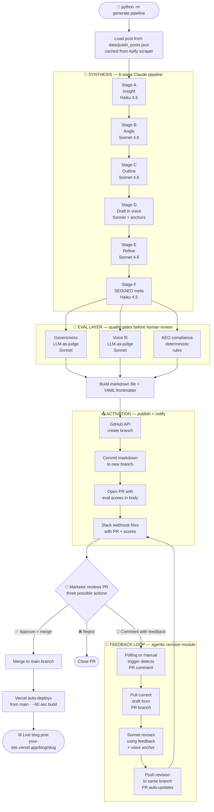

# Terret Content Workflow

> An agentic content workflow that converts Justin Shriber's LinkedIn posts into polished Terret blog posts — with human approval and an agent-driven feedback loop.

**Live demo:** [terret-content-workflow.vercel.app][LIVE_URL]
**Example post:** [Why your sales forecast breaks where reps stop updating CRM][POST_URL]
**Example PR (the approval moment):** [#2][PR_URL]

> *Replace the bracket-style links at the bottom of this file with your actual URLs before publishing.*

---

## TL;DR

- 6-stage Claude pipeline (Haiku + Sonnet) turns one LinkedIn post into a Terret-voice blog draft
- 3-eval quality gate (genericness, voice fit, AEO compliance) catches AI slop before a human sees it
- Slack notification + GitHub PR-as-approval workflow
- **Agent feedback loop**: marketer leaves a PR comment, agent pulls draft + feedback, generates revision, pushes it back — no manual intervention
- LinkedIn scraper module behind a clean interface (Apify-based); cached `data/justin_posts.json` used for demo determinism
- Dark-themed Astro site auto-deploys to Vercel on every PR merge

Built around one principle: **output quality is the only thing that matters. Everything else is secondary.**

---

## The Big Picture

What happens from the moment you type `python -m generate.pipeline` to the post going live on Vercel:



Every box is a function in the repo. Every arrow is a signal between systems (API call, file commit, webhook). The feedback loop arrow back to the Slack node is the agentic revision flow — marketer feedback triggers a re-draft, no manual intervention.

---

## Architecture — 4 Layers

The whole system maps to the brief's evaluation criteria.

| Layer | What it does | Why this design |
|---|---|---|
| **🔍 Monitoring** | Justin's posts → `data/justin_posts.json` | Cached for demo determinism. Apify scraper module (`scrape/justin_scraper.py`) refreshes on demand. |
| **🧠 Synthesis** | 6 focused Claude calls instead of one mega-prompt | Per-stage evals when output drifts. Model mixing (Haiku for classification, Sonnet for drafting) cuts cost ~25%. |
| **🧑 Human Control** | Slack → GitHub PR. Merge = approve. Comment = trigger revision. | Free audit log via git history. Revision module turns "feedback" into a real workflow, not a dead-end. |
| **📤 Activation** | Astro markdown → Vercel auto-deploy. Full structured data. | JSON-LD + FAQ schema + llms.txt for AEO — content surfaces in AI answer engines, not just human search. |

> *Cross-cutting: a 3-check eval layer (genericness, voice fit, AEO compliance) runs against every draft before it reaches a human.*

---

## The Live Example

One complete LinkedIn post → blog post cycle, fully run.

| Step | What happens | Artifact |
|---|---|---|
| **Source** | Justin's Ferrari-analogy LinkedIn post | [original LinkedIn URL][SRC_URL] |
| **Stage A — Insight** (Haiku) | Extracts core operator argument | [JSON output][STAGE_A] |
| **Stage B — Angle** (Sonnet) | Develops Terret-specific framing | [JSON output][STAGE_B] |
| **Stage C — Outline** (Sonnet) | Structures the post | [JSON output][STAGE_C] |
| **Stage D — Draft** (Sonnet) | Drafts in Terret's voice using 3 anchor blogs | [markdown draft][STAGE_D] |
| **Stage E — Refine** (Sonnet) | Editor pass for AI tells + voice drift | [refined markdown][STAGE_E] |
| **Stage F — SEO/AEO** (Haiku) | Generates title, slug, meta, FAQ schema | [metadata JSON][STAGE_F] |
| **Slack notification** | Bot posts with eval scores + PR link | [screenshot][SLACK_SS] |
| **PR (approval moment)** | Marketer merges to publish | [PR #2 — merged][PR_URL] |
| **Live post** | Vercel auto-deploys | [view live][POST_URL] |

### Eval scores on the published version

| Metric | Score | Status |
|---|---|---|
| Genericness | 6/10 | ⚠ improving (see iteration log) |
| Voice fit | 8/10 | ✓ |
| AEO compliance | passes all checks | ✓ |

Full diagnostic JSON: `examples/post_001_result.json`

---

## Iteration Log

The blog draft went through three iterations. Each was driven by the eval layer flagging a specific failure.

| Iteration | Genericness | Voice fit | AEO | What broke | What I fixed |
|---|---|---|---|---|---|
| **v1** | 31/42 manual rubric | — | — | No TL;DR, no FAQ, fabricated stat, 92-char title, generic CTA | Stage D mandatory structure + Stage E verification checklist |
| **v2** | 4/10 ❌ | 7/10 ⚠ | ❌ | Generic SaaS framing, sub-50-char title, meta description out of range | Stage D "Genericness Defense" block + Stage F title floor, loosened meta range |
| **v3** (shipped) | 6/10 ⚠ | 8/10 ✓ | ✓ | Output is publishable | — |

> The diagnostic-driven loop — eval flags a specific failure → targeted prompt update → re-run → measure — is the workflow the brief was actually testing for.

---

## Judgment Calls

| Decision | What & why |
|---|---|
| **Multi-stage pipeline over single mega-prompt** | 6 focused Claude calls. Each stage has a tight system prompt and per-piece evals. Mega-prompt would be faster to write but black-box on failure. |
| **Sonnet for drafting, Haiku for classification** | Voice quality matters most in Stage D. Stages A and F are extraction work — Haiku is plenty smart and ~4x cheaper. ~25% cost savings vs all-Sonnet. |
| **"What this is NOT" field in Stage B** | ★ The move I'm most proud of. Forces the agent to name the generic angle it's rejecting *as part of its output.* Single change that moved genericness 4 → 6. |
| **GitHub PR merge as approval** | Free, audit-logged via git history, no UI to build. Downside: needs GitHub access — v2 fix is Slack interactive buttons. |
| **Agent feedback loop on PR comments** | Reviewer comments trigger a revision pass that addresses the feedback while preserving voice. Pushes revision back to same branch. PR auto-updates. *Closes the loop.* |
| **Genericness eval (LLM-as-judge)** | Direct response to the brief's stated failure mode. Asks Claude to mentally swap "Terret" with "Acme Corp" — if post still makes sense, it's generic. |
| **AEO over just SEO** | JSON-LD + FAQ schema + `llms.txt` so content surfaces in ChatGPT, Perplexity, AI Overviews — not just Google. |
| **Apify scraper as capability, cached JSON as demo source** | Scraper module is in the repo; pipeline reads from cache for determinism. Apify is the production-realistic answer (managed headless browser, rate limits) but live scraping during a demo is unnecessary risk. |
| **Astro + Vercel + GitHub for CMS** | Markdown frontmatter = real structured content. Git commit = real publish. All free. WordPress was the conventional alternative but heavier API. |
| **Dark Terret-themed site design** | Visual fit matters as much as voice fit. The brief tests "does it read like something a real marketing team would publish?" Inspired-by, not pixel-cloned. |

---

## What Breaks

Honest failure modes. Production fixes named.

### 1. Genericness eval is itself an LLM judge
Calibration risk: if my judge thinks "Terret-specific" differs from a human reviewer's read, drafts pass eval but still feel generic to readers.
**Fix:** multi-reviewer eval set, not pure LLM-as-judge.

### 2. Voice anchor library is static
As Terret's voice evolves, agent drifts toward yesterday's voice.
**Fix:** marketer-edited drafts feed back into anchor updates. System compounds.

### 3. LinkedIn ingestion is the real long-term hard part
Manual + cached works for prototype. Apify is the production path but ToS risk needs legal sign-off. Live scraping during demo would be unnecessary risk — chose cached for determinism.
**Fix:** scheduled Apify job + manual upload fallback for video posts.

### 4. GitHub PR approval requires GitHub access
Fine for engineering-adjacent teams; bad for pure marketing orgs.
**Fix:** Retool app or Slack interactive buttons with audit.

### 5. The Astro `slug` schema bug
Astro 4.x deprecated user-defined `slug` fields. Vercel deployment failed until I removed `slug` from schema and switched template to `post.slug`. Two-line fix, but exactly the integration-layer brittleness that bites every CMS workflow.
**Fix:** local CI build step that catches schema mismatches before push.

### 6. Video-format LinkedIn posts
Pipeline ingests text only. Justin's video posts have thin written captions.
**Fix:** extend to Whisper or AssemblyAI transcription, route through same pipeline.

### 7. No learning loop across drafts (yet)
Revision module closes the loop *within* a single draft. The next step is making approved drafts improve future drafts via voice anchor updates.
**Fix:** capture marketer edits + rejection reasons, feed into prompt refinement.

---

## What I'd Build Next

Prioritized by impact, not effort:

1. **Close the eval loop across drafts.** Marketer edits update voice anchors. Every approval makes the next draft better. The revision module is the first half of this — the second half is the anchor feedback.
2. **Production approval UI.** Slack interactive buttons with auth + audit. Removes GitHub dependency.
3. **Automated Apify ingestion.** Scheduled scraper with rate-limit handling + manual upload fallback for video posts.
4. **Multi-author voice fingerprinting.** Generalize from Justin to arbitrary Terret leadership.
5. **A/B angle variants.** Generate 2-3 angle versions per insight; let marketing pick. The choice itself becomes signal.

---

## How to Run It

```bash
git clone https://github.com/[username]/terret-content-workflow.git
cd terret-content-workflow

python3 -m venv venv
source venv/bin/activate
pip install -r requirements.txt

cd site && npm install && cd ..

cp .env.example .env
# Fill in:
#   ANTHROPIC_API_KEY, SLACK_WEBHOOK_URL, GITHUB_TOKEN, GITHUB_REPO
#   APIFY_TOKEN (optional — only needed for live LinkedIn scraping)
```

### Run the pipeline

```bash
# Default — runs on post_001 in cached JSON
python -m generate.pipeline

# Pick a specific post
python -m generate.pipeline post_005
```

Takes ~30-60 seconds. Opens a PR, sends Slack notification, saves diagnostic to `examples/post_001_result.json`.

### Refresh the scraper cache (optional, requires APIFY_TOKEN)

```bash
python -m scripts.scrape_justin
```

Calls Apify to fetch fresh posts, overwrites `data/justin_posts.json`.

### Run the feedback-loop revision module

```bash
# Manual mode — revise PR #7 based on its latest comment
python -m revise.handle_feedback --pr 7

# Polling mode — watch all open PRs for feedback every 60 sec
python -m revise.handle_feedback --poll 60
```

---

## Tech Stack

| Layer | Tool | Why |
|---|---|---|
| LLM | Claude Sonnet 4.6 + Haiku 4.5 | Sonnet for planning/drafting, Haiku for classification |
| Orchestration | Plain Python | Readable, debuggable, no framework lock-in |
| Scraping (prod path) | Apify managed actor | Handles headless browser, rate limits, auth rotation |
| Notification | Slack incoming webhook | Free, where marketers live |
| Approval | GitHub PR merge | Free, audit-logged, no UI to build |
| Revision | PyGithub + Claude Sonnet | Pulls draft, revises with feedback, pushes back |
| CMS | Astro + Vercel | Markdown frontmatter + auto-deploy + free |
| Evals | Custom Python | LLM-as-judge (genericness, voice) + rules (AEO) |

**Cost per pipeline run:** ~$0.12 in Anthropic API calls (8 calls — 6 Sonnet, 2 Haiku, plus 2 eval LLM-as-judge passes).

---

## Repo Structure

```
terret-content-workflow/
├── data/
│   └── justin_posts.json          # 12 ranked Justin LinkedIn posts (cache)
├── voice_anchors/                  # 6 Terret blog voice anchors
├── prompts/                        # 6 pipeline stages + 1 revise prompt
│   ├── stage_a_insight.txt
│   ├── stage_b_angle.txt
│   ├── stage_c_outline.txt
│   ├── stage_d_draft.txt
│   ├── stage_e_refine.txt
│   ├── stage_f_seo.txt
│   └── revise.txt
├── generate/
│   └── pipeline.py                 # 6-stage orchestrator
├── evals/
│   ├── genericness.py              # LLM-as-judge
│   ├── voice_fit.py                # LLM-as-judge
│   └── aeo_compliance.py           # rule-based
├── scrape/
│   └── justin_scraper.py           # Apify integration + cache fallback
├── scripts/
│   └── scrape_justin.py            # CLI to refresh the cache
├── notify/
│   └── slack.py                    # new draft + revision notifications
├── publish/
│   └── github_pr.py                # commit + open PR
├── revise/
│   └── handle_feedback.py          # feedback-loop revision module
├── site/                           # Astro CMS, auto-deploys to Vercel
├── examples/
│   ├── post_001_result.json        # full diagnostic for live example
│   └── iteration_log.md            # v1 → v2 → v3 detail
├── voice_guidelines.md             # voice fingerprint document
└── README.md
```

---

*Built as a project submission for the Terret Agentic Workflow Intern role · 2026*
*Riyana Malhotra · [LinkedIn][AUTHOR_LINKEDIN]*

[LIVE_URL]: https://terret-content-workflow-kol27rytq-riyana-malhotra-s-projects.vercel.app/
[POST_URL]: https://terret-content-workflow-kol27rytq-riyana-malhotra-s-projects.vercel.app/blog/sales-playbook-execution-gap-infrastructure
[PR_URL]: https://github.com/malhotrariyana-wq/terret-content-workflow/pull/15
[SRC_URL]: https://www.linkedin.com/posts/justinshriber_why-perfect-revops-engines-fall-apart-on-activity-7450915050745380864-SKNf?utm_source=share&utm_medium=member_desktop&rcm=ACoAAECIP6cBrBBpGMw_Yq3jfFvOn2OTawZIQ4g
[STAGE_A]: prompts/stage_a_insight.txt
[STAGE_B]: prompts/stage_b_angle.txt
[STAGE_C]: prompts/stage_c_outline.txt
[STAGE_D]: prompts/stage_d_draft.txt
[STAGE_E]: prompts/stage_e_refine.txt
[STAGE_F]: prompts/stage_f_seo.txt
[SLACK_SS]: file:///var/folders/vs/wpk7bj1j4lg3jx_p0f2zn1km0000gn/T/TemporaryItems/NSIRD_screencaptureui_b1Ug5W/Screenshot%202026-05-18%20at%202.28.52%E2%80%AFPM.png
[AUTHOR_LINKEDIN]: https://www.linkedin.com/in/riyana-malhotra-887701262/